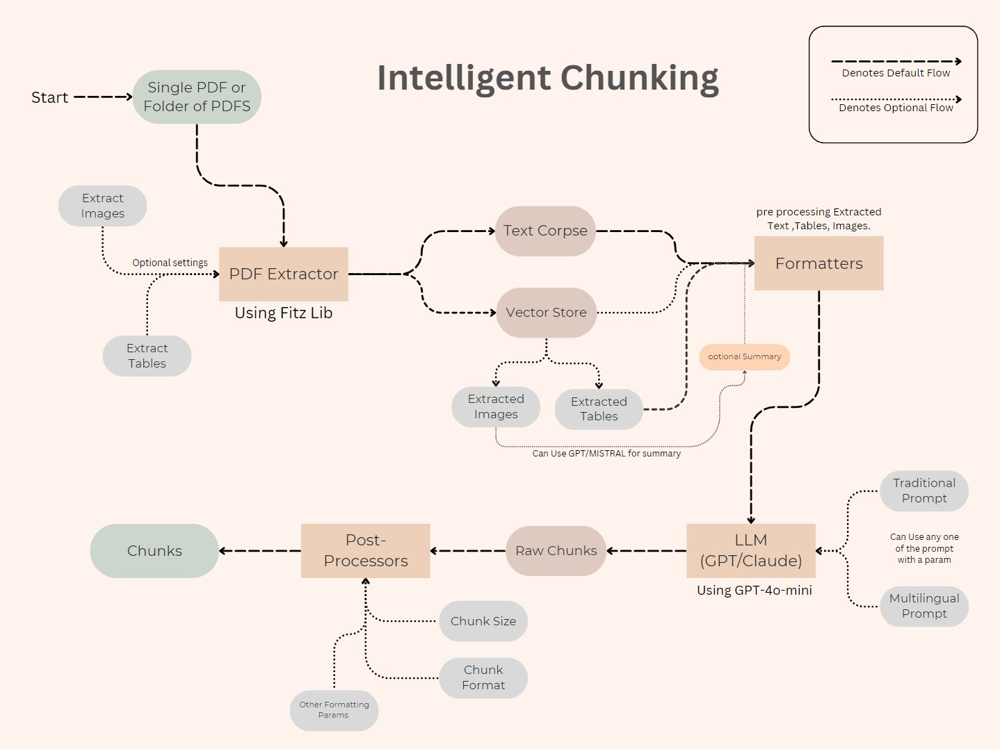

# Intelligent Chunking: Enhancing Document Processing for RAG Systems

*Author: Rahul Ganapragasam*

## Introduction

In the fast-paced world of natural language processing, efficiently handling and processing large documents is more important than ever. That’s where chunking comes in—a technique that breaks down documents into digestible pieces. By organizing data into well-defined chunks, this process makes it easier for powerful large language models (LLMs) like GPT and Claude to understand content and generate meaningful responses.

Enter **Intelligent Chunking**, a powerful project designed to automatically chunk documents based on context, optimizing them for use in Retrieval-Augmented Generation (RAG) systems. This blog post explores the steps involved in Intelligent Chunking, its advantages, and how it can be leveraged to enhance the performance of RAG systems.

## What is Chunking?

Chunking is the process of dividing a document into smaller, coherent segments or "chunks" that can be processed independently. In the context of NLP, chunking ensures that each segment is contextually meaningful, allowing models to generate more accurate and relevant responses. This technique is particularly useful when dealing with lengthy documents that exceed the token limits of LLMs.


## Intelligent Chunking: A Step-by-Step Breakdown

### Architecture Diagram



### Step 1: Extraction

The first step in the Intelligent Chunking process is extracting content from a PDF document. Using the `Fitz` Python library, users can extract not only text but also images and tables. Depending on the user's requirements, tables and images can either be extracted as they are or summarized using any open source model prefered by the user, making the extracted content more manageable.

### Step 2: Preprocessing

Once the content is extracted, the next step is preprocessing. This involves organizing the extracted data into a well-structured corpus. The preprocessing stage includes:
- Removing duplicate paragraphs and lines.
- Properly aligning text and tables.
- Dividing the corpus into segments if it exceeds 4096 tokens, with each segment ranging between 3000 to 3500 tokens beacuse most of the llms can only accept a specific amount of tokens in our case both claude and GPT only accepts input tokens that are under 4096 tokens.

This step ensures that the corpus is clean, organized, and ready for further processing with llms.

### Step 3: Generating Raw Chunks

In this stage, the segmented corpus is fed into an LLM (such as GPT or Claude) with specific prompts designed to generate chunks. Users can choose between a multilingual prompt or an English default prompt, depending on their needs. The LLM then generates raw chunks, which include titles, chunk numbers, and content.

default prompt:

```bash

Given the provided text data, your task is to chunk the text into meaningful segments or 'chunks' based on the topics or sections mentioned within the text. Each chunk should encapsulate a distinct topic or subtopic discussed within the text corpus. Your goal is to parse the text into coherent units that represent the main themes or ideas conveyed in the text.

You can identify the boundaries of each chunk by looking for section headers or topic labels within the text. These headers typically indicate the start of a new topic or section. Your output should consist of the identified chunks, along with their corresponding labels or headers.

Please ensure that each chunk is clearly delineated and captures a cohesive set of information related to its respective topic or theme. Additionally, consider the overall structure and coherence of the chunks to facilitate understanding and interpretation by readers.

Feel free to leverage the contextual information provided in the text to guide your chunking process. Remember, the objective is to organize the text into digestible segments that effectively convey the main ideas discussed within the text corpus.

<important>

Note: You should not modify the text in the corpus; your only job is to split (chunk) the corpus accordingly. your are strictly not allowed to reduce the content of chunk it should be same as the raw corpse provides. if the input corpse is 1000 tokents the output should also be 1000 tokens,if the input corpse is 2000 tokens the output tokents should be 2000.if a chunk croses 800 words please divide it if a chunk is 1600 words divide it by 800 word chunk and 800 word chunk. 
    
    The chunks should follow a format like this:

    <chunk 1>
    Topic:topic for chunk 1
    Content:content of Chunk 1
    </chunk 1>
    ...
    
    Remember : you should not reduce content nor summarise it your only job is to divide corpse to chunks. the chunks should be a perfect sub-class of corpse(super-class).

</important>

```

### Step 4: Post-Processing Raw Chunks

The raw chunks generated by the LLM contain valuable information but require further processing to be usable. During post-processing:
- The chunks are refined to include titles, subtopics, start and end indexes, total tokens, and the file name.
- Advanced regular expressions (`Regex`) are used to extract and structure this information, ensuring each chunk is contextually relevant and organized.

All processed chunks are then stored in a JSON file, making them easily accessible for future use.

## Benefits of Intelligent Chunking in RAG Systems

Intelligent Chunking offers significant advantages in RAG systems, where the quality and relevance of retrieved information are paramount. By breaking down documents into contextually meaningful chunks, Intelligent Chunking ensures that the LLMs can retrieve and generate more accurate and relevant responses. This enhances the overall performance of RAG systems, leading to better user experiences and more reliable outcomes.

## Future Improvements

While Intelligent Chunking is already a robust solution, there are areas for further enhancement:
1. **LLM-Driven Start and End Line Detection**: Instead of generating entire chunks, LLMs can be used to identify start and end lines within a document, with regex employed to extract and match chunks more precisely.
2. **Parallel Processing**: Implementing parallel processing to chunk multiple PDFs simultaneously would significantly reduce processing time, making the system more efficient.

## Conclusion

Intelligent Chunking represents a significant advancement in document processing, particularly in the context of RAG systems. By automating the chunking process and ensuring that each chunk is contextually relevant, this project paves the way for more efficient and effective information retrieval and generation. As the project continues to evolve, it promises to further enhance the capabilities of RAG systems, making them more powerful and user-friendly.
